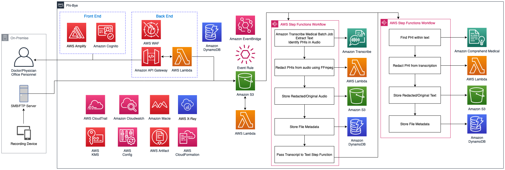

# Phi-Bye
## AWS Project 2023 - Developed By Jeremiah Webb

## Architecture Design

This data pipeline will take in audio & transcript text files with Protected Health Information (PHI) and output new audio files with the PHI redacted.  

## Getting Started
**WARNING when running this project, you account _will_ be charged by AWS. Please be aware of this.**

To begin, one must have an AWS Account.

### AWS Cloudformation Phi-Bye Data Pipeline Set Up

1. Run layer.yml - This will create a lambda layer which you must attach to the RemoveAudioPhiFunction.

2. Run final.yml - This is the complete backend for Phi-Bye.

3. Simply upload audio/text files to the landingphi S3 bucket and output will be in the resultphi bucket in respective folders which can be cross referenced via the file_table dynamodb table.

#### NOTE
If the layer.yml is not working, check the serverless repo for the ffmpeg layer [here](https://serverlessrepo.aws.amazon.com/applications/us-east-1/145266761615/ffmpeg-lambda-layer). You will have to create the ffmpeg layer from the repo, download it, change the template so it allows python 3.11 & 3.10. Reupload and manually attach the layer to the RemoveAudioPhiFunction.

### Amplify Website Set up
You will need to email me to retrieve the amplify website files for this project. Check below for contact information.  
Read this [page](https://docs.amplify.aws/cli/usage/export-to-cdk/#use-an-exported-amplify-backend-in-aws-cloud-development-kit-cdk) for using the amplify website in cdk. 
Please note the project uses the React Framework and NPM.  
1. Cloudformation templates for used services for both the serverless backend Amplify website and API gatway are in amplify-phi-bye/amplify/backend.
2. Please note that the lambda functions that are used by API gateway must be changed to use your named s3 buckets. These functions are called geturl & pullDynamodb. Both are located in amplify/backend with respective folders containing code & templates for deployment.

### Conclusion
After setup of both the data pipeline and amplify website, simply go to amplify-phi-bye directory and use npm start to begin the website. 

# Contact
Jeremiah L Webb (Jeremiah_L_Webb@hotmail.com or WebbJ31@my.erau.edu)

# Links
[HIPAA Law](https://www.hhs.gov/hipaa/for-professionals/privacy/index.html) 
[AWS HIPAA Page](https://aws.amazon.com/compliance/hipaa-compliance/) 
[Architecting for HIPAA on AWS White Paper](https://docs.aws.amazon.com/pdfs/whitepapers/latest/architecting-hipaa-security-and-compliance-on-aws/architecting-hipaa-security-and-compliance-on-aws.pdf)
